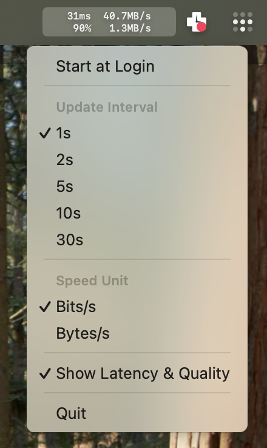

# NetSpeedMonitor

> 🌐 **[View the official website](https://guerrerocarlos.github.io/NetSpeedMonitor/)**

Just a minimal menu bar macOS app that displays real-time network upload/download speeds.

It runs `sysctl` with c interface in a repeating timer.

Use at your own risk.

## Installation

### Via Homebrew (Recommended)
```bash
brew tap guerrerocarlos/tap
brew install --cask netspeedmonitor
```

### Manual Installation
1. Download the latest release from [Releases](https://github.com/guerrerocarlos/NetSpeedMonitor/releases)
2. Extract NetSpeedMonitor.app.zip
3. Move NetSpeedMonitor.app to /Applications/
4. Remove quarantine attribute:
   ```bash
   sudo xattr -rd com.apple.quarantine /Applications/NetSpeedMonitor.app
   ```

## Features

- **Real-time Network Monitoring**: Displays upload and download speeds in the menu bar
- **Multiple Display Modes**: Toggle between Bytes/s and Bits/s (Mbps)
- **Network Latency**: Monitor connection quality with real-time latency measurements
- **Customizable Update Intervals**: Choose from 1s, 2s, 5s, 10s, or 30s refresh rates
- **Auto-launch at Login**: Optional automatic startup with macOS
- **Activity Monitor Integration**: Quick access to Activity Monitor for detailed process inspection
- **Pure Swift Implementation**: Native SwiftUI interface with efficient sysctl-based network monitoring
- **Minimal Resource Usage**: Lightweight menu bar app with negligible CPU/memory footprint

## Recent Improvements

Since the last community contribution, the app has undergone significant enhancements:

### Core Features
- ✨ **Latency Measurement**: Real-time network quality monitoring with visual indicators
- 🔄 **Bytes/Bits Toggle**: Switch between B/s and b/s (Mbps) display units
- 📊 **Quality Indicators**: Visual representation of connection quality based on latency
- 🎨 **Improved Menu Layout**: Better spacing and formatting for readability

### Development & Distribution
- 📦 **Homebrew Support**: Easy installation via `brew install --cask netspeedmonitor`
- 🤖 **Automated Releases**: GitHub Actions workflow for continuous deployment
- 🏗️ **Build Script**: Comprehensive `build_app.sh` for creating .app bundles
- 🔧 **Swift Package Manager**: Full SwiftPM support for CLI-first development
- 📝 **Complete Migration**: Removed Objective-C++ bridge, now 100% Swift

### Technical Improvements
- 🚀 **Performance Optimizations**: Enhanced latency calculation and network stat parsing
- 🐛 **Bug Fixes**: Resolved logging issues and menu text formatting
- 📚 **Better Documentation**: Added AGENTS.md for AI-assisted development workflows

## Note

For per-process network traffic monitoring, it usually requires `nettop` which is quite cpu-heavy making it impractical to keep running at the background. Implementing it to run only when the user click the status item to make the menu showing may be a good choice.

From v1.8, the UI is built using SwiftUI, on macOS 15, with minimum system version macOS 14.6. Since I haven't successfully built it with lower version of github action runner images, it is what it is now. Later if I have the chance, I would make it compatible with lower version of macOS.

Any PR for feature enhancement or compatibility improvement is welcomed!

# Screenshot



## Distribution

NetSpeedMonitor is available through multiple channels:

- **Homebrew Cask**: Official tap at `guerrerocarlos/tap` (recommended)
- **GitHub Releases**: Pre-built `.app` bundles with automated builds
- **Source Build**: Via Xcode, xcodebuild, or Swift Package Manager

For maintainers and contributors, see [HOMEBREW.md](HOMEBREW.md) for distribution guidelines.

## System Requirements

- macOS 14.0 (Sonoma) or later

## Building from Source

### Xcode
1. Install the full Xcode (15 or newer) and set it active: `sudo xcode-select -s /Applications/Xcode.app/Contents/Developer`.
2. Open `NetSpeedMonitor.xcodeproj` in Xcode, select the `NetSpeedMonitor` scheme, configure code signing, then build with **Product ▸ Build** (⌘B).

### Command line via Xcode build tools
```bash
xcodebuild -project NetSpeedMonitor.xcodeproj \
           -scheme NetSpeedMonitor \
           -configuration Release \
           -derivedDataPath Build \
           clean build
```

The `.app` bundle appears at `Build/Build/Products/Release/NetSpeedMonitor.app`.

### Pure Swift toolchain (SwiftPM)
```bash
swift run --configuration release NetSpeedMonitor
```

This uses `Package.swift` to compile and launch the menu bar app without Xcode. To distribute a standalone `.app`, wrap the release binary (`.build/release/NetSpeedMonitor`) in a macOS application bundle that copies `NetSpeedMonitor/Info.plist` and embeds required resources. Some features (such as launch-at-login registration) expect the app to live inside a bundle with a stable bundle identifier.

Minimum supported macOS version remains 14.6.
